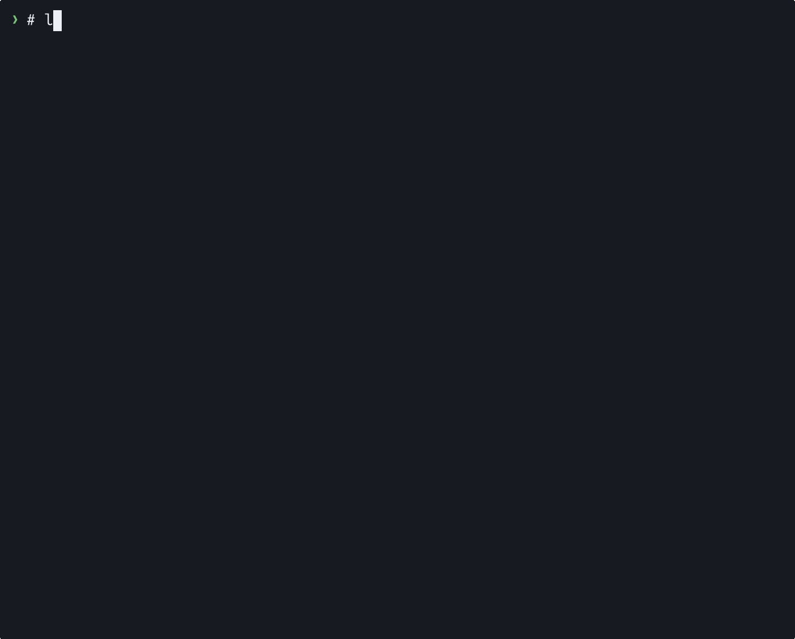

# lsa

`ls` for agent sessions. List every session from every coding agent on the
machine, newest first. Resume the conversation, print it or pipe it to another
agent.



Like `ls`, `lsa` on its own lists the sessions started in the current
directory. `-a` lists them all. Listing takes about as long as `ls -l`.

## Install

One command, on macOS or Linux:

```sh
curl -fLO https://github.com/jakemanger/lsa/releases/latest/download/lsa && sudo install lsa /usr/local/bin/
```

Downloads `lsa` and installs it with executable permissions.

**Oh My Zsh?** Replace its default `lsa='ls -lah'` alias with the `lsa` command:

```sh
printf '\nunalias lsa 2>/dev/null\n' >> ~/.zshrc && source ~/.zshrc
```

Needs bash 3.2 or later, grep, sed, awk, find, stat and ps. `lsa show` also
needs `jq`, and the database-backed agents need `sqlite3`.

### Package managers

Homebrew (macOS and Linux):

```sh
brew install jakemanger/tap/lsa
```

Debian / Ubuntu:

```sh
sudo mkdir -p /etc/apt/keyrings
sudo curl -fsSL https://jakemanger.github.io/lsa/apt/lsa.asc -o /etc/apt/keyrings/lsa.asc
sudo curl -fsSL https://jakemanger.github.io/lsa/apt/lsa.sources -o /etc/apt/sources.list.d/lsa.sources
sudo apt update && sudo apt install lsa
```

Add the repository once; subsequent updates come through `sudo apt upgrade`.

Fedora / RHEL:

```sh
curl -fLO https://github.com/jakemanger/lsa/releases/latest/download/lsa.rpm
sudo dnf install ./lsa.rpm
```

Arch Linux:

```sh
curl -fLO https://github.com/jakemanger/lsa/releases/latest/download/lsa.pkg.tar.zst
sudo pacman -U ./lsa.pkg.tar.zst
```

The Homebrew tap supports `brew upgrade lsa`. RPM and Arch packages are
release downloads; use the same commands to update them. All package managers
install the required dependencies.

## Agents

| Agent | | List | Show | Resume | Tested |
|---|---|:-:|:-:|:-:|:-:|
| Claude Code | ✳ | ✓ | ✓ | ✓ | ✓ |
| Codex | ⌘ | ✓ | ✓ | ✓ | ✓ |
| pi | π | ✓ | ✓ | ✓ | ✓ |
| Qwen Code | ❯ | ✓ | ✓ | ✓ | ✓ |
| OpenCode | ◐ | ✓ | ✓ | ✓ | ✓ |
| Goose | 🪿 | ✓ | ✓ | ✓ | ✓ |
| Cline | ⌬ | ✓ | ✓ | ✓ | ✓ |
| Muse Code (Meta) | ◈ | ✓ | ✓ | ✓ | ✓ |
| OpenClaw | 🦞 | ✓ | ✓ | ✓ | ✓ |
| Gemini CLI | ✦ | ✓ | ✓ | ✓ | from source |

Tested means I installed the agent, ran a session and checked that `lsa`
listed it, printed it and reopened it. Gemini CLI needs a Google account
I do not have, so its reader was written from the CLI's own source and
the fixture matches what that code writes; if you use it, `lsa -a -t gemini`
and an issue with what you see, good or bad, gets it a tick. Want another
agent? Open an issue with one session file.

Resume runs the agent's own command (`claude --resume`, `codex resume`,
`muse resume`, and so on) from the directory the session was started in,
because most agents only find a session from there. `lsa -l` adds the full
working directory and transcript path as columns on the same row.
OpenClaw sessions
are chats rather than projects, so their directory column shows the session
key instead.

Skipped on purpose: Claude Code's sub-agent files, Codex Desktop's internal
reviewer threads (`guardian_review`), OpenCode's sub-agent sessions, and
Cline's VS Code extension, which keeps its tasks in a different place from
the Cline CLI. Cursor is not read.

## Use

```
lsa                 sessions started in this directory
lsa -a              every session
lsa ~/code/foo      sessions started in another directory
lsa -t codex -n 5   the five newest Codex sessions
lsa -l              add full directory and transcript path columns

lsa show 659c       print a transcript as plain text
lsa path 659c       print where the transcript lives
lsa resume 659c     reopen it in its own agent
lsa resume 0        the same by index, like tmux attach -t 0
```


A session whose transcript changed in the last two minutes, and whose agent
has a live process, shows a green `●` and how long the current turn has been
running, counted from the last prompt you typed, in place of its age:

```
  0 claude   ● 2m      3e1f    add a --dry-run flag to the deploy script
  1 codex    15m ago   01a0c7d the flaky test in api/test_auth.py
```

That is the whole detection: an agent writes to its transcript while it
works and stops when it is waiting on you, so an open but idle session is
not marked. With colour off the marker is `▶`.

A session is named by its index or its id. Index 0 is the newest session
on the machine and the numbers are global, so `lsa resume 3` is the same
session whether you listed with `-a` or not. Ids are the shortest prefix
that is unique on your machine, the way git shortens hashes; any longer
prefix of the full id works too. `show` works well with a pager or grep:

```
lsa show 659c | less
lsa show 659c | grep -n 'TODO'
```

Long format keeps one row per session: index, agent, age (or busy duration),
full working directory, short id, transcript path, and first prompt. Paths
are never truncated, so long rows may wrap in a narrow terminal. Cline and
Muse point to their conversation files, rather than their metadata indexes.
OpenCode, Goose and OpenClaw store conversations in a shared SQLite database;
their paths are marked `[shared database]`. Deleting one of those databases
would delete other sessions too. `lsa path <id>` prints just the path.

Repeated prompts can be real, separate sessions. For example, Pi's Claude
bridge keeps a Pi conversation plus Claude Code backing sessions. It can
create a new Claude session and import the same history after an interrupted
turn, an error, or resuming Pi. Those files have distinct ids even though
their first prompt matches, so `lsa` lists them separately. Use `-t pi` to
see only the Pi conversations, or `-l` to inspect each backing file.

### Switch agents

Pick a session from `lsa`, then run one of these from its project directory:

```sh
# Continue the conversation in Claude Code
lsa show 659c | claude -p "Continue this conversation from where it left off."

# Or hand it to Codex or Pi
lsa show 659c | codex exec "Continue this conversation from where it left off."
lsa show 659c | pi -p "Continue this conversation from where it left off."
```

The source session can be from any supported agent. Each command starts a
new session, runs a turn, and exits. Run `lsa` again, then
`lsa resume <new-id>` to keep chatting interactively in the new agent.

The handoff carries the readable transcript, without images or the original
agent's internal state. Very long chats may need trimming to fit the new
model's context window.

Piped input and session resume verified with Claude Code 2.1.277, Codex CLI
0.155.1, and Pi 0.85.1 using the Claude bridge.

## Where it looks

| Agent       | Where                                                       | Override              |
|-------------|-------------------------------------------------------------|-----------------------|
| Claude Code | `~/.claude/projects/*/*.jsonl`                              | `CLAUDE_CONFIG_DIR`   |
| Codex       | `~/.codex/sessions/YYYY/MM/DD/*.jsonl`                      | `CODEX_HOME`          |
| pi          | `~/.pi/agent/sessions/*/*.jsonl`                            | `PI_CODING_AGENT_DIR` |
| Qwen Code   | `~/.qwen/projects/*/chats/*.jsonl`                          | |
| Gemini CLI  | `~/.gemini/tmp/*/chats/session-*.jsonl` + `projects.json`   | `GEMINI_CLI_HOME` |
| Cline       | `~/.cline/data/sessions/*/*.json`                           | |
| OpenCode    | `~/.local/share/opencode/opencode.db`                       | `XDG_DATA_HOME` |
| Goose       | `~/.local/share/goose/sessions/sessions.db`                 | `XDG_DATA_HOME` |
| Muse Code   | `~/.local/share/muse/session-index.db`                      | `XDG_DATA_HOME` |
| OpenClaw    | `~/.openclaw/agents/*/agent/openclaw-agent.sqlite`          | |

The last four are SQLite databases and are read with the `sqlite3` binary
that ships with macOS and most Linux distributions; without it those
agents are silently skipped.

A session's directory and first prompt never change, so they are cached in
`~/.cache/lsa/` after the first run. Listing is then one directory scan,
one `stat` and one `awk`, about the cost of `ls -l` on the same files.
Delete the cache directory if you ever want a rescan. Nothing else is
written, nothing leaves the machine.

## Adding an agent

For an agent that writes files: a line in the `ROOTS` table, a branch in
the `parse` awk that pulls the directory and first prompt out of one file,
and a branch in `join_cache` that takes the id from the file name. For one
that keeps a database: a query in `db_rows`. Then a `resume_cmd` case, a
`cmd_show` case, and a fixture in `test.sh`. Pull requests welcome, and
please say which version of the agent wrote your fixture.

## Development

```
make test        run the fixture tests
make lint        ShellCheck, workflow lint and formula syntax
make packages    build .deb, .rpm and Arch packages (needs nFPM)
make check-packages  check the release files locally
make formula     refresh the Homebrew formula's version and checksum
make install     copy to /usr/local/bin
demo/record.sh   re-record the gifs (asciinema + agg; invented sessions,
                 plus one real Goose session over ollama for the resume)
```

## Licence

MIT.
